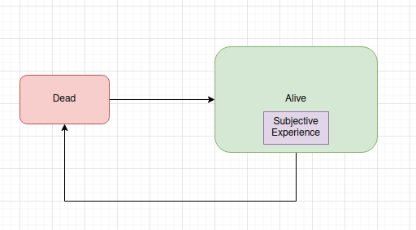

# Thoughts on Life and Death
Growing up in a religious home, I spent a lot of my childhood thinking about eternity.  I was taught that each person had a soul, and that soul was essentially what made you you.  The soul was eternal, and thus its destiny was of supreme importance.  I remember reading Thomas Aquinas' *Summa Theologica* at night trying to understand what I believed to be the metaphysics of reality.  

While I no longer hold those ideas, I do recall having a thought, perhaps around age 10 or 11, where I stumbled across the idea of what I now call "Eternal Experience".  To put it poetically:

From nothing I came.  
To nothing I will return.  
And from nothing once more I will emerge.  

Let me explain the meaning of this short poem.  

## Time Flies When You are Dead
I didn't experience the 13.8 or so billion years from the big bang to the year I was born.  I wasn't alive.  But that time passed, from my own subjective experience, pretty much instantaneously.  From the perspective of me, t=0 corresponds to my birth year, not the big bang (or whatever may have come before it).  I was effectively "dead" for all that time, if we consider "dead" being the same as "not alive".  

From this point, it also stands to reason that the time between my death and the death of the universe will also, from my subjective perspective, pass instantaneously.  This is quite significant, since our current understanding permits eons on the order of hundreds of orders of magnitude.  Of course, our understanding of physics does not permit a perfectly eternally stable universe, so it also stands to reason that something akin to the big bang (for example, if [conformal cyclic cosmology](https://en.wikipedia.org/wiki/Conformal_cyclic_cosmology) turns out to be true) could happen in the future, and at some point the necessary conditions could again arise that "reinstantiate" (or in more classical parlance, resurrect) you.  

How could this happen?  I can imagine a few ways.  First, if you are very well preserved at the time of death (i.e. [cryopreservation](https://waitbutwhy.com/2016/03/cryonics.html)), it may be possible for doctors to repair the damage done to your body and revive you.  In this case, you would not have any memory of the intervening time and from your perspective it would seem as though you were dying in the hospital one moment, then emerging from a cryo pod in the next.  

Another possibility is that your final moments are recreated in some kind of simulation well enough that, for all intents and purposes, it *is* you.  Similar to the concept of "fidelity" in the HBO series *WestWorld*.  In the show, some characters are reanimated in robotic form, and the characters can experience a brief resurrection before their bodies reject their minds and they once again die.  A superintelligent AI or advanced alien civilization may be capable of reconstructing history well enough to extrapolate from your last moments, thus resurrecting you from the dead.  

Another more bizarre but theoretically possible situation is where the random movements of particles in the universe coalesce into a briefly functioning human brain with all of *your* memories intact.  This concept, known as a [Boltzmann Brain](https://en.wikipedia.org/wiki/Boltzmann_brain), would enable you to haltingly continue experience over unimaginably long timescales (though I don't think I would prefer this outcome).  

But the main point of these examples is to demonstrate that being dead for a while doesn't guarantee that you stay that way forever.  In fact, the opposite might be true.  No matter how many times you die, your subjective experience will always be transported to the next moment where you are no longer dead.

The above diagram shows Subjective Experience requiring being alive.  

## A note on similar ideas
It should be noted that this idea does not imply reincarnation, or starting a new kind of life from scratch.  I think there has to be some kind of continuity of experience, meaning that you have to preserve some critical amount of information from one moment to the next.  It also doesn't imply that wherever you reemerge is going to be a familiar or favorable environment for you.  Simply that there will be an eternal stream of subjective experience, however disjointed temporally.  

I'm also not expecting [Eternal Return](https://en.wikipedia.org/wiki/Eternal_return).  In those ideas, everything repeats in an endless loop.  I reject the idea for similar reasons to reincarnation, where being reborn would imply a total loss of all previous memory and experience, and essentially collapses all the loops into just one.  Instead, it is possible that time behaves like a [Penrose Tiling](https://en.wikipedia.org/wiki/Penrose_tiling), which covers an infinite area without ever exactly repeating itself.  That does not, however, preclude from resurrecting you since there may be multiple configurations that are sufficient to reinstantiate your subjective experience.  

I'm also not proposing or proselytizing for Hindu, Buddhist or Daoist notions of eternal life.  In this construction of Eternal Experience, there is no objective moral component.  There is no external judge that is deciding the conditions for your next experience, and there is no desired "end state" akin to [Nirvana](https://en.wikipedia.org/wiki/Nirvana) or [Moksha](https://en.wikipedia.org/wiki/Moksha). There is simply eternal experience.  Whether or not it is possible to transcend to other forms of (non)reality is beyond what I can say.  

## That is not Dead

There is a [quote](https://en.wikipedia.org/wiki/That_Is_Not_Dead) from H.P. Lovecraft that has always intrigued me:

"That is not dead which can eternal lie yet with strange aeons even death may die"

The implications of Eternal Experience are profound.  While there is no objective standard of karma, there may be a subjective version.  We know that everything we do ripples out into the cosmos at the speed of light.  Our actions now do have the potential to echo for all eternity.  The significance of those actions will undoubtedly be tied to the actions themselves, but even the smallest fluctuations can have [cosmic impact](https://en.wikipedia.org/wiki/Baryon_acoustic_oscillations).  With this understanding, I hope that my actions will echo such that future experiences will be ones I like.  If I behave in a way that contributes to the downfall of humanity, I may be "punished" with reanimation by entities that have no understanding of what I want or enjoy, and may have to suffer uncomfortably for some time.  If I help humanity survive this era and expand to the stars, the time between my death and life may be short and my experience pleasant and long.

But I cannot know the degree to which I can influence these futures, or the conditions which will dictate my reemergence.  I can only control my actions today and act such that in light of eternity, I find my experience worth having.  

### P.S.
Recently Guillermo del Toro illustrated this concept quite well recently:  
https://www.youtube.com/watch?v=QL0FOWTHrGA